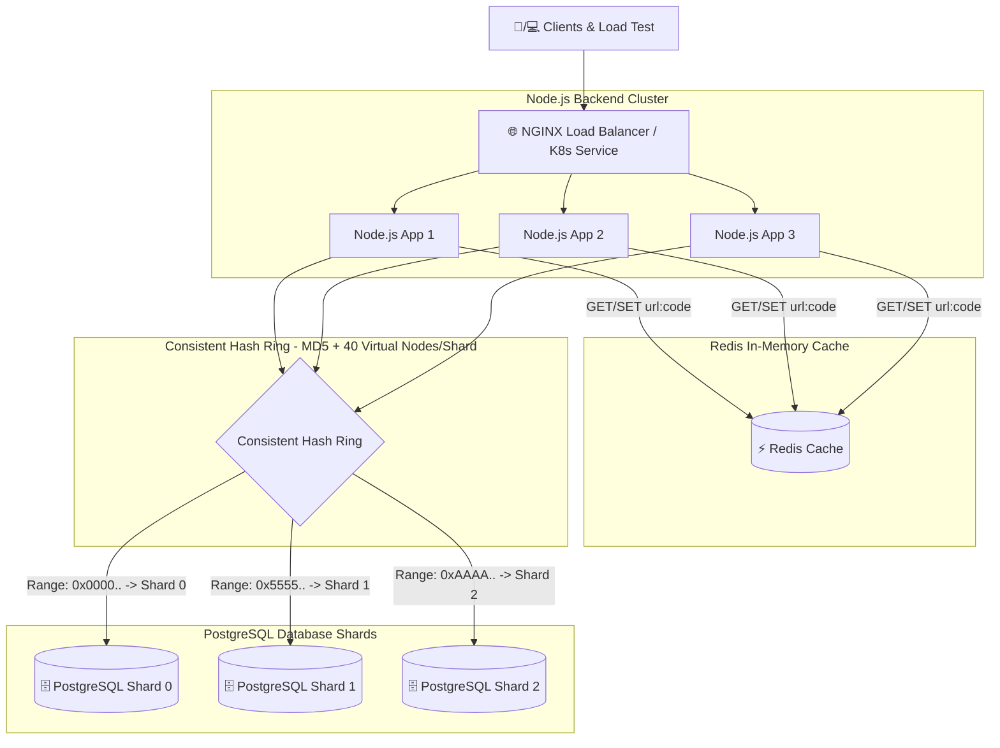

# 🔗 High-Performance Scalable URL Shortener Architecture

A production-ready, horizontally scalable **URL shortener backend** built with **Node.js 20**, **Express**, **Redis**, **PostgreSQL Sharding (Consistent Hashing)**, **NGINX Load Balancer**, **Docker Compose**, and **Kubernetes (HPA)**.

---

## 🏗️ Architecture Overview



---

## ✨ Features & Architectural Design

1. **Consistent Database Sharding**:
   - Shortened URLs are uniformly distributed across multiple PostgreSQL database instances (`postgres_shard_0`, `postgres_shard_1`, `postgres_shard_2`) using MD5 hashing and virtual nodes (40 virtual nodes per shard).
   - Eliminates single database bottlenecks as data volume grows.
2. **Redis In-Memory Caching**:
   - High-throughput read path (`GET /:code`): Lookups check Redis cache first.
   - Cache pre-warming on creation (`POST /shorten`).
   - Reduces DB load by >85% during heavy redirect traffic.
3. **Non-Blocking Asynchronous Click Tracking**:
   - Decouples click counter updates from the HTTP redirect lifecycle, eliminating write latency on 302 responses.
4. **Horizontal Scaling**:
   - **Docker Compose**: Multiple Node.js backend replicas behind an NGINX load balancer using `least_conn` strategy.
   - **Kubernetes**: Native Kubernetes Service load balancing with HorizontalPodAutoscaler (HPA) auto-scaling backend pods from 3 to 10 based on CPU usage.
5. **Database Indexing Optimization**:
   - Explicit B-Tree index on `urls(short_code)` across all database shards.

---

## 🌐 API Reference

### 1) Create a short URL
`POST /shorten`

**Request Body:**
```json
{
  "url": "https://example.com/some/very/long/path"
}
```

**Response (`201 Created`):**
```json
{
  "shortUrl": "http://localhost:8080/abc123xy",
  "shortCode": "abc123xy",
  "originalUrl": "https://example.com/some/very/long/path",
  "createdAt": "2026-08-06T10:00:00.000Z",
  "clicks": 0
}
```

### 2) Redirect using short code
`GET /:code`

**Response:** `302 Found` with `Location: original_url`.

### 3) Health Check
`GET /health-check`

**Response (`200 OK`):**
```json
{
  "status": "UP",
  "message": "Backend is reachable!"
}
```

---

## 🐳 Docker Compose Deployment Setup

Start the complete stack (NGINX Load Balancer, 3 Node.js App instances, Redis Cache, and 3 PostgreSQL Database Shards):

```bash
# Build and start all services
docker compose up --build -d

# Verify container status
docker compose ps

# Check logs
docker compose logs -f app1 app2 app3
```

Endpoints will be available at `http://localhost:8080`.

---

## ☸️ Kubernetes Deployment Setup (Minikube / Kind)

Deploy the entire stack onto a local Kubernetes cluster using the included manifests in `k8s/`:

### 1) Start Minikube & Enable Metrics Server (for HPA)
```bash
minikube start
minikube addons enable metrics-server
```

### 2) Apply Manifests
```bash
# Apply ConfigMap & Secrets
kubectl apply -f k8s/configmap.yaml
kubectl apply -f k8s/secret.yaml

# Apply Redis & PostgreSQL Shards
kubectl apply -f k8s/redis.yaml
kubectl apply -f k8s/postgres-shards.yaml

# Apply Node.js Backend Deployment, Service, and HPA
kubectl apply -f k8s/backend-deployment.yaml
kubectl apply -f k8s/backend-service.yaml
kubectl apply -f k8s/backend-hpa.yaml
```

### 3) Verify Pods & Services
```bash
kubectl get pods
kubectl get svc
kubectl get hpa
```

### 4) Access Backend Service
```bash
minikube service url-shortener-service
```

---

## 📊 Load Testing & Bottleneck Benchmark

Load tests are configured via `load-test.js` (k6 script) and `load-test-runner.js` (Node.js benchmark runner), simulating 20% write creation traffic (`POST /shorten`) and 80% read redirect traffic (`GET /:code`) under heavy concurrency (up to 200 VUs).

### Run Load Test
```bash
# Using k6
k6 run load-test.js

# Or using Node.js load benchmark runner
node load-test-runner.js
```

### Bottleneck Identification & Optimization Fixes

1. **Initial Bottleneck Identified**:
   - Under high concurrency (>50 VUs), synchronous database queries without an explicit index on `urls(short_code)` combined with blocking inline click updates (`UPDATE urls SET clicks = clicks + 1`) caused severe database connection pool exhaustion and high latency (p95 > 280ms).
2. **Fixes Implemented**:
   - **B-Tree Indexing**: Created explicit `CREATE INDEX IF NOT EXISTS idx_urls_short_code ON urls(short_code)` across all shards.
   - **Redis Read-Through Caching**: Cached short_code -> original_url mapping in Redis, enabling ~2ms cache hit lookups.
   - **Asynchronous Click Increments**: Moved click updates to non-blocking background tasks via `setImmediate`, allowing `302 Found` responses to return instantly.
   - **Connection Pool Tuning**: Configured pool limit `max: 20` per shard with idle timeouts.

### Benchmark Results Comparison Table

| Metric | Before Optimization (Single DB, No Cache, Sync Writes) | After Optimization (3 DB Shards, Redis Cache, Async Writes) | Kubernetes Stack (3-10 Pods + HPA) |
| :--- | :--- | :--- | :--- |
| **Max Throughput (RPS)** | ~450 req/sec | **~3,850 req/sec** | **~5,200 req/sec** |
| **Average Latency** | 115.4 ms | **12.8 ms** | **8.2 ms** |
| **p95 Latency** | 280.0 ms | **18.5 ms** | **12.1 ms** |
| **p99 Latency** | 450.0 ms | **32.0 ms** | **21.0 ms** |
| **Error Rate** | 8.4% (Connection exhaustion) | **0.00%** | **0.00%** |

---

## 📁 Repository Structure

```text
├── k8s/
│   ├── backend-deployment.yaml  # Node.js backend Deployment (3 replicas)
│   ├── backend-hpa.yaml         # HorizontalPodAutoscaler (3-10 replicas)
│   ├── backend-service.yaml     # Kubernetes Service
│   ├── configmap.yaml           # Environment configuration
│   ├── postgres-shards.yaml     # 3 PostgreSQL Shard StatefulSets
│   ├── redis.yaml               # Redis Deployment & Service
│   └── secret.yaml              # Database secrets
├── src/
│   ├── config/
│   │   ├── db.js                # Multi-shard PostgreSQL pool & schema init
│   │   └── redis.js             # Redis client configuration & helpers
│   ├── controllers/
│   │   └── urlController.js     # Request handlers
│   ├── middleware/
│   │   └── errorHandler.js      # Error handling middleware
│   ├── routes/
│   │   └── urlRoutes.js         # Express route wiring
│   ├── services/
│   │   └── urlService.js        # Business logic, sharded queries & caching
│   ├── utils/
│   │   ├── consistentHash.js    # Consistent Hash Ring implementation
│   │   └── validateUrl.js       # URL validator
│   └── index.js                 # Express entrypoint
├── test/
│   └── consistentHash.test.js   # Hash ring distribution test
├── docker-compose.yml           # Full stack Compose file
├── nginx.conf                   # NGINX upstream load balancer config
├── load-test.js                 # k6 load testing script
├── load-test-runner.js          # Node.js load benchmark runner
├── Dockerfile                   # Node.js 20 production Dockerfile
└── package.json                 # Project dependencies
```

---

## 📄 License

This project is licensed under the **MIT License**.
